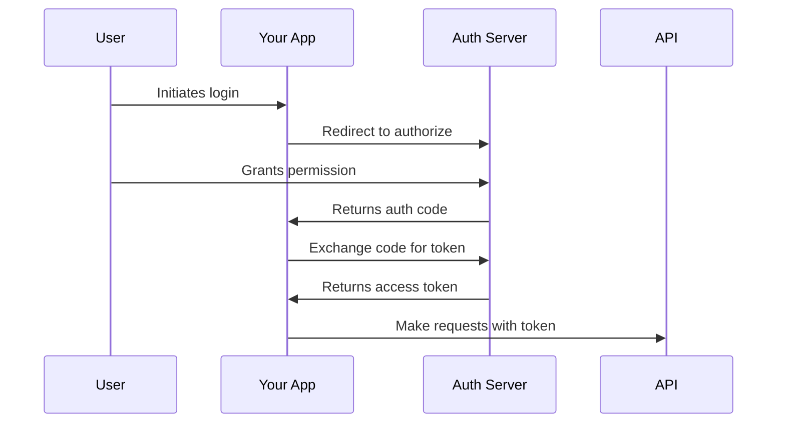

# Authentication
{: .no_toc }

## Table of contents
{: .no_toc .text-delta }

1. TOC
{:toc}

---

## Overview

Our API supports multiple authentication methods to suit different use cases:

- **API Keys** - Simple authentication for server-to-server communication
- **OAuth 2.0** - For applications that need to act on behalf of users
- **JWT Tokens** - Stateless authentication for distributed systems
- **Webhook Signatures** - Verify webhook authenticity

## API Key Authentication

### Obtaining an API Key

1. Log in to your [Dashboard](https://dashboard.example.com)
2. Navigate to **Settings** → **API Keys**
3. Click **Generate New Key**
4. Set permissions and expiration (optional)
5. Copy and securely store your key

{: .warning }
> **Security Warning:** API keys are shown only once. Store them securely and never expose them in client-side code.

### Using API Keys

Include the API key in the `Authorization` header:

```bash
curl -H "Authorization: Bearer YOUR_API_KEY" \
     https://api.example.com/v2/resource
```

### API Key Best Practices

- **Rotate regularly** - Change keys every 90 days
- **Use environment variables** - Never hardcode keys
- **Restrict permissions** - Grant minimum required access
- **Monitor usage** - Review API key activity logs
- **Implement IP whitelisting** - Restrict key usage by IP

## OAuth 2.0 Authentication

### OAuth Flow



### Implementation

#### Step 1: Register Your Application

```bash
POST /oauth/applications
{
  "name": "My Application",
  "redirect_uris": ["https://myapp.com/callback"],
  "scopes": ["read:users", "write:projects"]
}
```

#### Step 2: Authorization Request

```javascript
const authUrl = new URL('https://auth.example.com/oauth/authorize');
authUrl.searchParams.append('client_id', CLIENT_ID);
authUrl.searchParams.append('redirect_uri', REDIRECT_URI);
authUrl.searchParams.append('response_type', 'code');
authUrl.searchParams.append('scope', 'read:users write:projects');
authUrl.searchParams.append('state', generateRandomState());

window.location.href = authUrl.toString();
```

#### Step 3: Token Exchange

```javascript
const response = await fetch('https://auth.example.com/oauth/token', {
  method: 'POST',
  headers: {
    'Content-Type': 'application/json'
  },
  body: JSON.stringify({
    grant_type: 'authorization_code',
    code: authorizationCode,
    client_id: CLIENT_ID,
    client_secret: CLIENT_SECRET,
    redirect_uri: REDIRECT_URI
  })
});

const { access_token, refresh_token } = await response.json();
```

#### Step 4: Using the Access Token

```javascript
const response = await fetch('https://api.example.com/v2/users', {
  headers: {
    'Authorization': `Bearer ${access_token}`
  }
});
```

### Refreshing Tokens

```javascript
const response = await fetch('https://auth.example.com/oauth/token', {
  method: 'POST',
  headers: {
    'Content-Type': 'application/json'
  },
  body: JSON.stringify({
    grant_type: 'refresh_token',
    refresh_token: refresh_token,
    client_id: CLIENT_ID,
    client_secret: CLIENT_SECRET
  })
});

const { access_token: new_token } = await response.json();
```

## JWT Authentication

### JWT Structure

JWTs consist of three parts:

```
header.payload.signature
```

Example decoded payload:

```json
{
  "sub": "user_123",
  "name": "John Doe",
  "iat": 1516239022,
  "exp": 1516242622,
  "scopes": ["read:all", "write:own"]
}
```

### Generating JWTs

```javascript
const jwt = require('jsonwebtoken');

const token = jwt.sign(
  {
    sub: userId,
    name: userName,
    scopes: ['read:all', 'write:own']
  },
  JWT_SECRET,
  {
    expiresIn: '1h',
    issuer: 'api.example.com'
  }
);
```

### Verifying JWTs

```javascript
try {
  const decoded = jwt.verify(token, JWT_SECRET, {
    issuer: 'api.example.com'
  });
  console.log('Valid token:', decoded);
} catch (error) {
  console.error('Invalid token:', error.message);
}
```

## Webhook Signatures

### Verifying Webhook Authenticity

All webhooks include a signature header for verification:

```javascript
const crypto = require('crypto');

function verifyWebhookSignature(payload, signature, secret) {
  const expectedSignature = crypto
    .createHmac('sha256', secret)
    .update(payload)
    .digest('hex');
  
  return crypto.timingSafeEqual(
    Buffer.from(signature),
    Buffer.from(expectedSignature)
  );
}

// In your webhook handler
app.post('/webhook', (req, res) => {
  const signature = req.headers['x-webhook-signature'];
  const isValid = verifyWebhookSignature(
    JSON.stringify(req.body),
    signature,
    WEBHOOK_SECRET
  );
  
  if (!isValid) {
    return res.status(401).send('Invalid signature');
  }
  
  // Process webhook...
});
```

## Security Headers

Include these headers in authenticated requests:

```http
Authorization: Bearer YOUR_TOKEN
X-API-Version: 2.0
X-Request-ID: unique-request-id
X-Client-Version: 1.0.0
```

## Permission Scopes

### Available Scopes

| Scope | Description |
|:------|:------------|
| `read:users` | Read user information |
| `write:users` | Create/update users |
| `delete:users` | Delete users |
| `read:projects` | Read project data |
| `write:projects` | Create/update projects |
| `admin:all` | Full administrative access |

### Requesting Scopes

```javascript
// OAuth flow
const scopes = ['read:users', 'write:projects'].join(' ');

// API key creation
POST /api-keys
{
  "name": "Production Key",
  "scopes": ["read:users", "write:projects"]
}
```

## Rate Limiting by Authentication Type

| Method | Rate Limit | Burst | Notes |
|:-------|:-----------|:------|:------|
| API Key | 10,000/hour | 100/sec | Per key |
| OAuth | 5,000/hour | 50/sec | Per user |
| JWT | 10,000/hour | 100/sec | Per token |
| Unauthenticated | 100/hour | 5/sec | Per IP |

## Common Authentication Errors

### 401 Unauthorized

```json
{
  "error": {
    "code": "UNAUTHORIZED",
    "message": "Invalid or missing authentication credentials"
  }
}
```

**Solutions:**
- Verify API key is correct
- Check token hasn't expired
- Ensure proper header format

### 403 Forbidden

```json
{
  "error": {
    "code": "FORBIDDEN",
    "message": "Insufficient permissions for this operation"
  }
}
```

**Solutions:**
- Check required scopes
- Verify resource ownership
- Review permission settings

## Testing Authentication

### Using cURL

```bash
# Test API key
curl -H "Authorization: Bearer YOUR_API_KEY" \
     https://api.example.com/v2/auth/test

# Test OAuth token
curl -H "Authorization: Bearer YOUR_ACCESS_TOKEN" \
     https://api.example.com/v2/auth/test
```

### Using Postman

1. Set Authorization type to "Bearer Token"
2. Enter your token
3. Send request to test endpoint

### Using Our SDK

```javascript
const client = new APIClient({
  apiKey: 'YOUR_API_KEY'
});

const result = await client.auth.test();
console.log('Authentication valid:', result.valid);
```

---

<div class="code-example" markdown="1">
**Security Tip:** Enable two-factor authentication on your account for additional API key security.
</div>